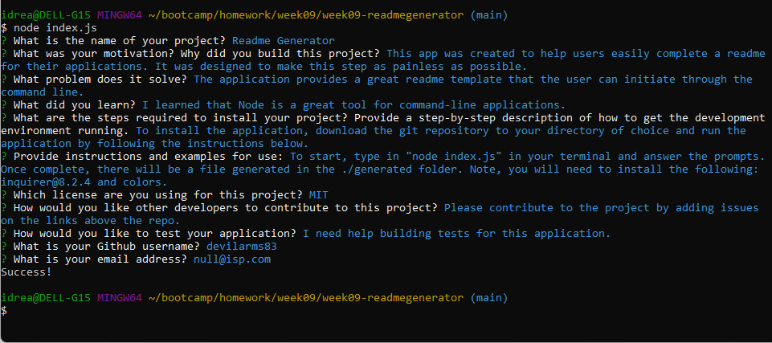
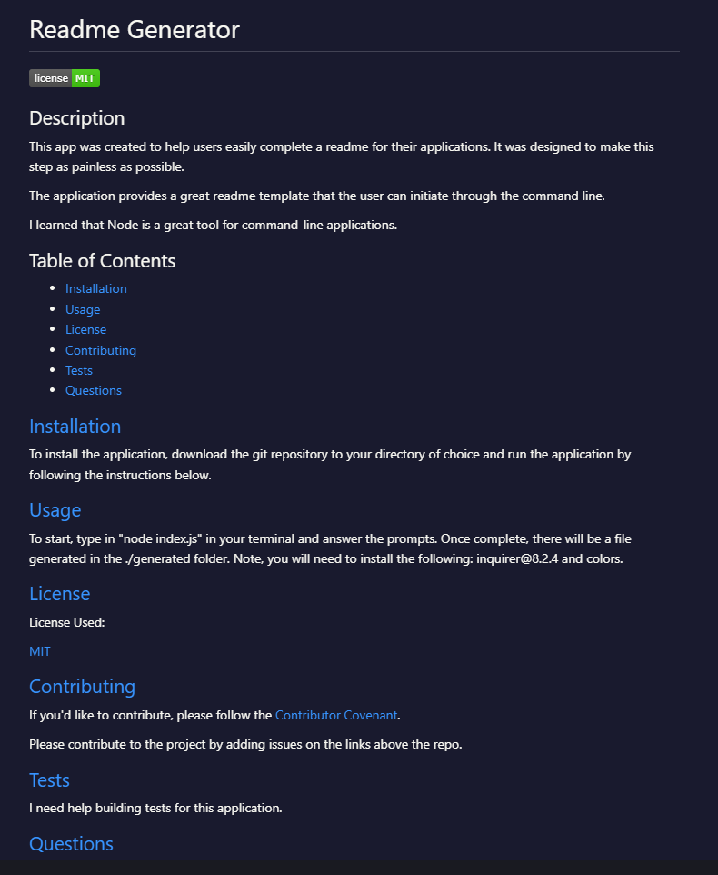

# Readme Generator

  
  
  ## Description
  
```md
AS A developer
I WANT a README generator
SO THAT I can quickly create a professional README for a new project
```
  
  This app was created to help users easily complete a readme for their applications. It was designed to make this step as painless as possible.

  The application provides a great readme template that the user can initiate through the command line.

  I learned that Node is a great tool for command-line applications.
  
  ## Acceptance Criteria

```md
GIVEN a command-line application that accepts user input
WHEN I am prompted for information about my application repository
THEN a high-quality, professional README.md is generated with the title of my project and sections entitled Description, Table of Contents, Installation, Usage, License, Contributing, Tests, and Questions
WHEN I enter my project title
THEN this is displayed as the title of the README
WHEN I enter a description, installation instructions, usage information, contribution guidelines, and test instructions
THEN this information is added to the sections of the README entitled Description, Installation, Usage, Contributing, and Tests
WHEN I choose a license for my application from a list of options
THEN a badge for that license is added near the top of the README and a notice is added to the section of the README entitled License that explains which license the application is covered under
WHEN I enter my GitHub username
THEN this is added to the section of the README entitled Questions, with a link to my GitHub profile
WHEN I enter my email address
THEN this is added to the section of the README entitled Questions, with instructions on how to reach me with additional questions
WHEN I click on the links in the Table of Contents
THEN I am taken to the corresponding section of the README
```
  
  ## Table of Contents 
  
  - [Installation](#installation)
  - [Usage](#usage)
  - [License](#license)
  - [Contributing](#contributing)
  - [Tests](#tests)
  - [Questions](#questions)
  
  ## [Installation](#table-of-contents)
  
  To install the application, download the git repository to your directory of choice and run the application by following the instructions below.
  
  ## [Usage](#table-of-contents)
  
  To start, type in "node index.js" in your terminal and answer the prompts. Once complete, there will be a file generated in the ./generated folder. Note, you will need to install the following: inquirer@8.2.4 and colors.

    What the terminal should look like:
  
  
    What the readme generated should look like:
    

Here's a link to a sample [video](https://drive.google.com/file/d/18Q0-aBVLVpEFiQI29cWv5Bn9HtDl7a6X/view?usp=sharing).
  
  ## [License](#table-of-contents)

  License Used:
  
  [MIT](https://choosealicense.com/licenses/mit)
    

  ## [Contributing](#table-of-contents)
  
  If you'd like to contribute, please follow the [Contributor Covenant](https://www.contributor-covenant.org/).

  Please contribute to the project by adding issues on the links above the repo.

  ## [Tests](#table-of-contents)
  
  I need help building tests for this application.
  
  ## [Questions](#table-of-contents)
  
  For additional questions, please reach out to:

  [GitHub: devilarms83](https://github.com/devilarms83)

  [Email: bautista.albert@gmail.com](mailto:bautista.albert@gmail.com)
